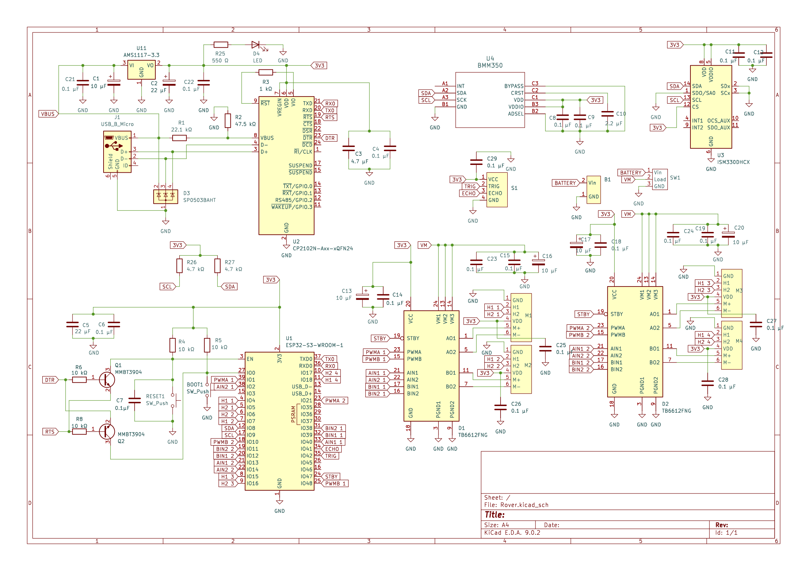
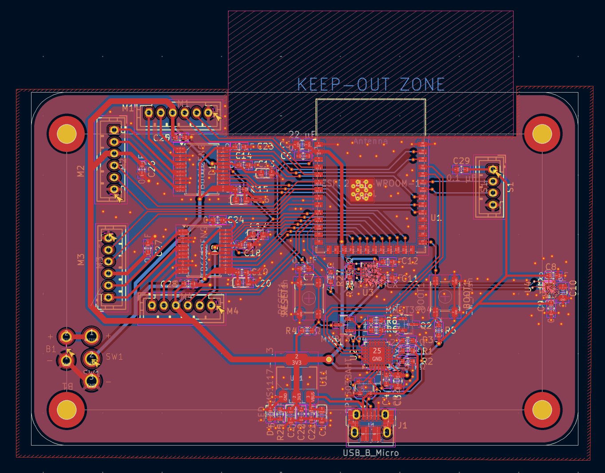
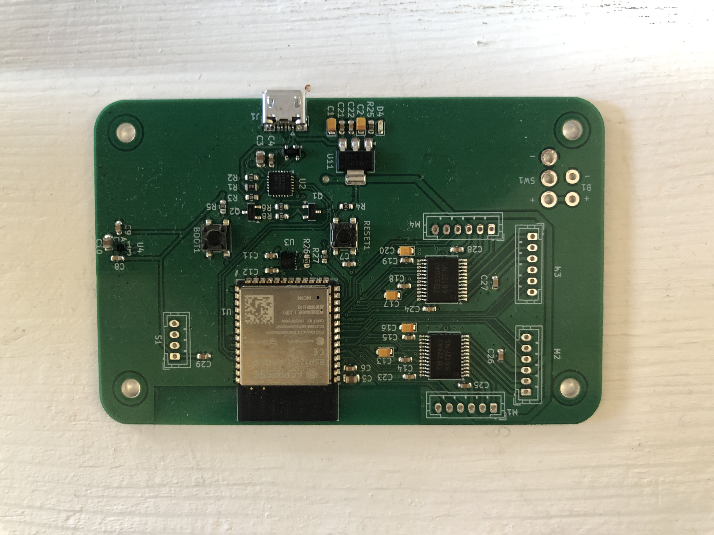
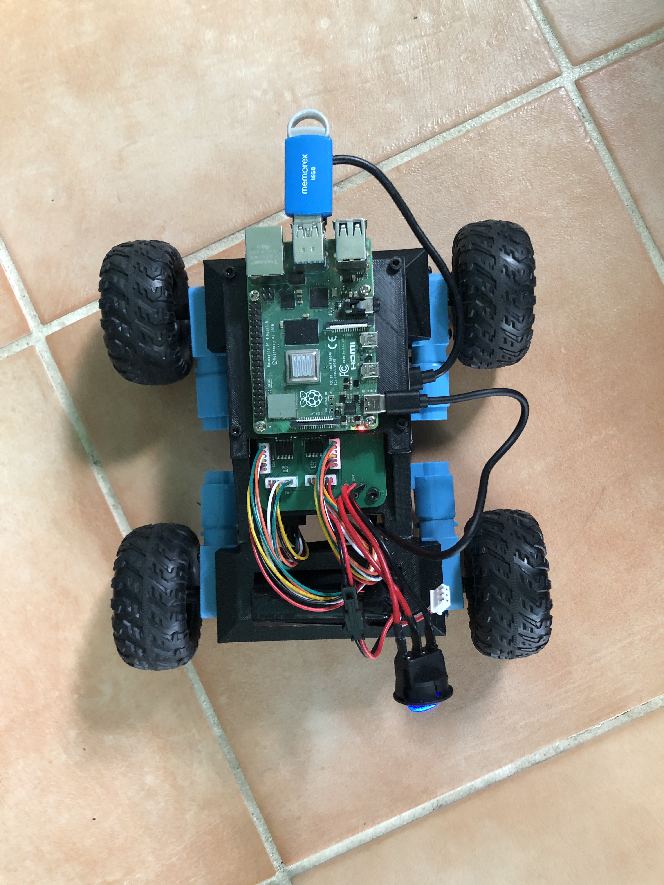

# Rover-Platform
ESP-IDF firmware, KiCad PCB, and Fusion360 Cad files  for a Rovere Platform

<p align="center">

</p>

# ESP-IDF

The file architecture is split into each of the remote's functions with each .c file also havng a complementary .h file allowing variable and function sharng across the project. The files can be found in rover_firmware/main:

```
config.c
encoder.c
imu.c
motor.c
speed_controller.c
uart_interface.c
```


- ```config.c``` Sets up and names the GPIO's used on the ESP32.<br>
- ```encoder.c``` Reads interrupts on quadrature encoders A and B terminals and creates tasks for counting which are added to queues. This file also allows for reading wheel rotation and speed.<br>
- ```imu.c``` Communicates with onboard IMU via I<sup>2</sup>C in order to receive sensor readings from accelerometer and gyroscope.<br>
- ```motor.c``` Generates a PWM signal using timer and compare events and provides a function for controlling motor speed and direction through duty cycle.<br>
- ```speed_controller.c``` Controls motor speed using a PID and non linear gain to adjust duty cycle written to motor. The feedback is obtained from the encoders.<br>
- ```uart_interface.c``` Receives speed commands for all four motors and writes wheel rotation, speed, accelerometer, and gyroscope readings.<br>


  * The files with the extension "_module" were used for the breadboard module prototyping.
  *  There are files for communicating with onboard Magnetometer, however these are not currently being used.

# Schematics

<p align="center">

</p>

- ESP32-S3-WROOM-1: Microcontroller used to run firmware, read sensors, and write to actuators
- CP2102A USB-to-UART: Interface for UART reading and writing and for uploading code to the ESP32-WROOM-32E. The NPN transistors circuitry automatically put the ESP32 into bootloader mode when a new upload happens.
- TB6612FNG: Dual Motor driver used for interfacing with 2 DC Motors. Uses A and B pins for motor direction and a PWM pin.
- ISM330DHCX: IMU chip used for accelerometer and gyroscope feedback. Uses I<sup>2</sup>C protocol for communication.

Chips not currently used
  • BMM350: Magnetometer chip with I<sup>2</sup>C protocol for communication.

# Final PCB Design

<p align="center">

</p>
<p align="center">

</p>

# Final Rover CAD Design
<p align="center">

</p>

